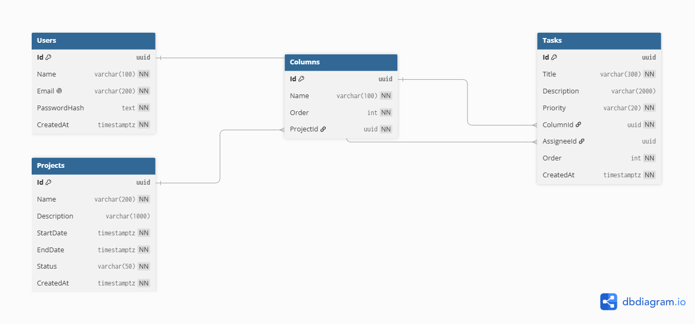

# AgileFlow — Scrum Board

Aplicativo web para la gestión de proyectos ágiles. Módulo inicial de una plataforma Scrum con tablero Kanban en tiempo real.

---

## 🚀 Instrucciones de ejecución

### Prerrequisitos
- Docker Desktop instalado y corriendo
- Git

### Pasos

1. **Clonar el repositorio**
```bash
git clone https://github.com/TU_USUARIO/scrum-board-AgileFlow.git
cd scrum-board-AgileFlow
```

2. **Crear el archivo de variables de entorno**
```bash
cp .env.example .env
```

3. **Levantar toda la solución**
```bash
docker compose up --build
```

4. **Acceder a la aplicación**
- Frontend: http://localhost
- API Swagger: http://localhost:5000/swagger

### Usuarios precargados
| Email | Contraseña |
|-------|------------|
| admin@agileflow.com | Admin123! |
| dev@agileflow.com | Dev123! |

---

## 🏗️ Decisiones arquitectónicas

### Backend — Arquitectura Hexagonal
El backend sigue la arquitectura hexagonal (puertos y adaptadores) con 4 capas:

- **AgileFlow.Domain** — Entidades y puertos (interfaces). Sin dependencias externas.
- **AgileFlow.Application** — Casos de uso, DTOs y puertos de aplicación. Depende solo de Domain.
- **AgileFlow.Infrastructure** — Implementaciones concretas: EF Core, repositorios, JWT, BCrypt, reportes. Depende de Application y Domain.
- **AgileFlow.Api** — Controladores REST, Hubs SignalR, punto de entrada. Depende de Application e Infrastructure.

**Justificación:** Esta separación garantiza que la lógica de negocio no depende de frameworks ni infraestructura. Los casos de uso son testeables sin base de datos ni HTTP.

### Frontend — Separación por capas
- **core/** — Servicios, modelos, guards e interceptores. Reutilizables en toda la app.
- **pages/** — Componentes de página (lazy loaded).
- **layout/** — Plantilla Sakai de PrimeNG.

### Autenticación
JWT con BCrypt + salt para el hash de contraseñas. El token se adjunta automáticamente en cada petición mediante un interceptor HTTP. Las rutas protegidas usan un guard de Angular.

---

## ⚡ Tiempo real — SignalR

**Tecnología elegida:** SignalR (WebSockets con fallback automático a Long Polling y Server-Sent Events).

**Justificación:** SignalR es la opción nativa del ecosistema .NET 8, ofrece reconexión automática, autenticación con JWT via query string para WebSockets, y grupos de conexión para aislar tableros. El cliente oficial `@microsoft/signalr` se integra limpiamente con Angular.

**Alternativas descartadas:**
- **WebSocket puro:** Requiere implementar manualmente reconexión, grupos y autenticación.
- **SSE (Server-Sent Events):** Unidireccional (servidor → cliente), no permite que el cliente notifique eventos al servidor.

**Canal autenticado:** El token JWT se pasa como `access_token` en la query string del handshake WebSocket, validado en el servidor mediante `JwtBearerEvents.OnMessageReceived`.

---

## 📊 Estrategia de índices de ordenamiento

Las tareas y columnas mantienen un campo `Order` (entero) que representa su posición dentro de la columna o proyecto respectivamente.

- Al crear: `Order = Max(existentes) + 1`
- Al reordenar: se recalculan todos los `Order` según el array `orderedIds` recibido
- Al mover entre columnas: `Order = Count(tareas en columna destino) + 1`

**Justificación:** El enfoque de índice entero secuencial es simple, eficiente para consultas con `ORDER BY` y fácil de recalcular. Para escalabilidad futura se podría migrar a índices con espaciado (1000, 2000...) para minimizar actualizaciones en reordenamientos.

---

## 📄 Patrón de exportación dual (PDF y Excel)

Se aplica el patrón **Strategy** mediante la interfaz `IReportExporter`:

```csharp
public interface IReportExporter
{
    string Format { get; }
    byte[] Export(ProjectReportDto report);
}
```

- `PdfReportExporter` implementa `IReportExporter` con QuestPDF
- `ExcelReportExporter` implementa `IReportExporter` con ClosedXML

El `ReportUseCases` recibe `IEnumerable<IReportExporter>` y selecciona el exportador por `Format`. Para agregar un tercer formato (ej. CSV) basta con crear una nueva clase que implemente `IReportExporter` y registrarla en el DI — sin modificar nada existente (principio Open/Closed).

Una sola consulta a la BD (`GetProjectReportAsync`) genera el `ProjectReportDto` que alimenta ambos formatos.

---

## 🗄️ Diagrama del modelo de base de datos



---

## 🤖 Uso de inteligencia artificial

Se utilizó **Claude (Anthropic)** como asistente en las siguientes áreas de soporte:

- **Scaffolding inicial:** generación de la estructura base de carpetas y proyectos (.NET solution, Angular workspace).
- **Configuración de herramientas:** setup de Docker Compose, nginx y configuración inicial de QuestPDF/ClosedXML.
- **Documentación:** Generacion del archivo README 


## 🛠️ Stack tecnológico

| Componente | Tecnología |
|------------|------------|
| Frontend | Angular 17 + PrimeNG 17 (Sakai) |
| Backend | .NET 8 C# API RESTful |
| Base de datos | PostgreSQL 16 |
| ORM | Entity Framework Core 8 |
| Tiempo real | SignalR |
| Reporte PDF | QuestPDF |
| Reporte Excel | ClosedXML |
| Contenedores | Docker + Docker Compose |
| Autenticación | JWT + BCrypt |

---

## 📁 Estructura del proyecto

```
scrum-board-AgileFlow/
├── AgileFlow-API/          # Backend .NET 8
│   ├── AgileFlow.Domain/   # Entidades y puertos
│   ├── AgileFlow.Application/ # Casos de uso y DTOs
│   ├── AgileFlow.Infrastructure/ # EF Core, repos, reportes
│   ├── AgileFlow.Api/      # Controllers, Hubs, Program.cs
│   └── AgileFlow.Tests/    # Pruebas unitarias backend
├── AgileFlow-FE/           # Frontend Angular 17
│   ├── src/app/
│   │   ├── core/           # Services, guards, interceptors
│   │   ├── pages/          # Componentes de página
│   │   └── layout/         # Plantilla Sakai
│   └── Dockerfile
├── docker-compose.yml
├── .env.example
└── README.md
```
